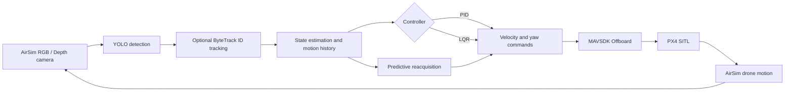
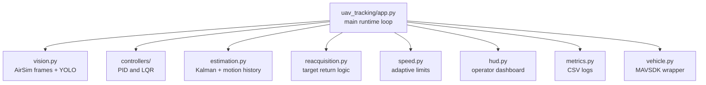

# UAV Visual Target Tracking in AirSim

Python project for visual target tracking with a simulated UAV in AirSim/PX4 SITL. The system detects a target with YOLO, estimates target motion, sends velocity commands through MAVSDK and compares PID and LQR controllers with reproducible metric scenarios.

The code was refactored from a single experimental script into a small package so that the control loop, controllers, estimators, reacquisition logic, HUD and metrics can be maintained independently.

## Visual Overview

The main runtime loop is built as a closed visual-servoing pipeline:



The repository is intentionally split into small modules:



## What Is Implemented

- YOLO-based target detection with optional ByteTrack tracking.
- PX4 offboard control through MAVSDK.
- PID controller with filtering, feed-forward, anti-windup and command slew limits.
- LQR controller with state observer, integral correction, feed-forward and command smoothing.
- Adaptive speed limits based on target velocity and image-edge proximity.
- Predictive reacquisition when the target leaves the camera frame.
- AirSim metric scenarios for PID/LQR comparison.
- Operator-style HUD with RGB view, depth view, live metrics, command plots and target status.

## Project Structure

```text
uav_tracking/
  app.py                 main AirSim + MAVSDK + YOLO loop
  config.py              controller and experiment parameters
  controllers/
    pid.py               PID tracker
    lqr.py               LQR tracker
  estimation.py          Kalman target model, image/body motion history, 27-zone predictor
  reacquisition.py       target return-to-frame logic
  speed.py               adaptive command limits
  hud.py                 classic and operator HUD rendering
  metrics.py             live CSV metric logger
  vehicle.py             MAVSDK wrapper for arm, takeoff, offboard and landing
  vision.py              AirSim RGB/depth capture and YOLO detector wrapper

scripts/
  run_tracking.py                    main entry point
  run_pid.py                         shortcut for PID mode
  run_lqr.py                         shortcut for LQR mode
  run_airsim_metric_suite.py         base live AirSim metric suite
  run_airsim_extended_metric_suite.py extended repeated/noise/latency/speed/occlusion suite
  run_airsim_depth_roi_metrics.py    depth ROI validation

benchmarks/
  offline and post-processing scripts for metric tables and reports
```

## Requirements

- Python 3.10+
- Microsoft AirSim environment
- PX4 SITL configured to connect to AirSim
- A trained YOLO model, for example `runs/detect/train4/weights/best.pt`
- CUDA-capable GPU is recommended for real-time YOLO inference, but CPU can be used for slower tests.

Official AirSim setup references:

- [AirSim custom Unreal environment guide](https://microsoft.github.io/AirSim/unreal_custenv/)
- [AirSim Windows build guide](https://microsoft.github.io/AirSim/build_windows/)

Python dependencies are listed in `requirements.txt`.

```powershell
python -m venv .venv
.\.venv\Scripts\activate
pip install -r requirements.txt
```

Large model weights and datasets are intentionally not stored in this repository. Put your trained YOLO weights locally and pass the path through `--weights`.

## Running the Tracker

Start AirSim and PX4 SITL first. Then run:

```powershell
python scripts/run_tracking.py --ctrl lqr --cube_name BP_TargetCube_5 --weights runs/detect/train4/weights/best.pt
```

PID mode:

```powershell
python scripts/run_tracking.py --ctrl pid --cube_name BP_TargetCube_5 --weights runs/detect/train4/weights/best.pt
```

Useful runtime keys:

- `1` - autonomous tracking
- `2` - manual drone control
- `3` - autonomous tracking with keyboard-controlled/scenario target motion
- `H` - hover toggle
- `L` - land and exit
- `Esc` - exit

The operator HUD is enabled by default. To use the old compact overlay:

```powershell
python scripts/run_tracking.py --ctrl lqr --cube_name BP_TargetCube_5 --hud_style classic
```

## Live Metric Runs

Single scenario:

```powershell
python scripts/run_tracking.py `
  --ctrl lqr `
  --cube_name BP_TargetCube_5 `
  --weights runs/detect/train4/weights/best.pt `
  --metrics_scenario lateral_sine `
  --metrics_duration 20 `
  --metrics_label lqr_lateral_sine_run01 `
  --metrics_log metrics_results/airsim_runs/lqr_lateral_sine_run01.csv `
  --land_on_finish
```

Base PID vs LQR suite:

```powershell
python scripts/run_airsim_metric_suite.py --cube_name BP_TargetCube_5 --duration 20 --controllers pid lqr
```

Extended suite with repeated runs, detection noise, latency, target speed, occlusion and full frame-exit tests:

```powershell
python scripts/run_airsim_extended_metric_suite.py --cube_name BP_TargetCube_5 --duration 20
```

For reproducible experiments, the extended suite can reset the drone and target cube to the same initial AirSim poses before and after each run.

## Metrics

The live CSV logs include frame-by-frame values used to compare controllers:

- distance error to the desired target range;
- image-plane error of the bounding-box center;
- visible ratio and lost episodes;
- reacquisition time;
- yaw command smoothness;
- command limits and target scenario metadata.

Post-processing scripts in `benchmarks/` aggregate these logs into tables suitable for a thesis report.

## GitHub Notes

This repository is meant to contain source code and documentation only. The following are ignored on purpose:

- virtual environment;
- YOLO weights;
- datasets and generated labels;
- training runs;
- AirSim metric CSV outputs;
- thesis render artifacts and local document templates.

If a reviewer wants to reproduce the project, provide model weights and AirSim/PX4 setup instructions separately, or attach the weights as a release artifact rather than committing them to Git.
